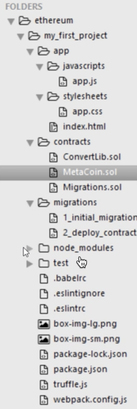
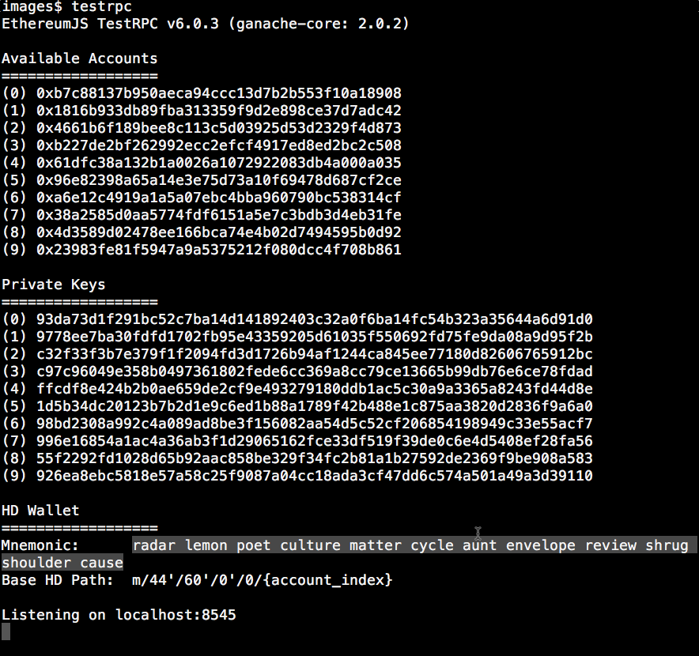
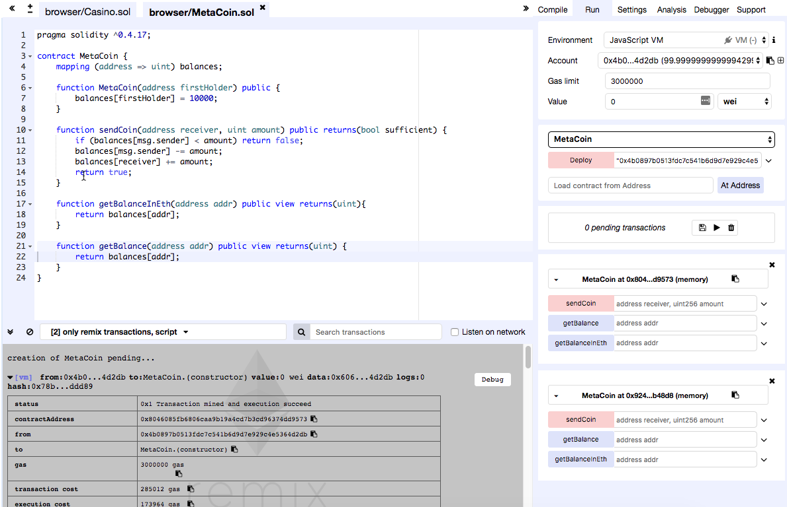

## Install Geth

    sudo apt-get install software-properties-common 
    sudo add-apt-repository -y ppa:ethereum/ethereum 
    sudo apt-get update 
    sudo apt-get install ethereum -y

## Run Geth

    geth -rpc -rpcaddr "0.0.0.0" --rpcport 8545 --rinkebyß

## Dev tools

Chrome plugin Metamask

Testrpc

    sudo npm install -g ethereumjs-testrpc
    testrpc

Truffle

    sudo npm install -g truffle
    truffle

## Starting a new project
1.  Create a folder
2.  In the folder, run truffle

        truffle unbox webpack

## Deploy an app
1.  Run "testrpc"
2.  Save the mnemonic

    
3.  In truffle.js, update "port" to the value on which testrpc is listening
4.  Compile from the root of the project

        truffle compile
5.  Deploy

        truffle migrate

## Debugging contracts

   https://remix.ethereum.org

1.  Compile tab
2.  Run tab

    a.  Select Environment

    b.  Select Account

    c.  Click Deploy

    

radar lemon poet culture matter cycle aunt envelope review shrug shoulder cause