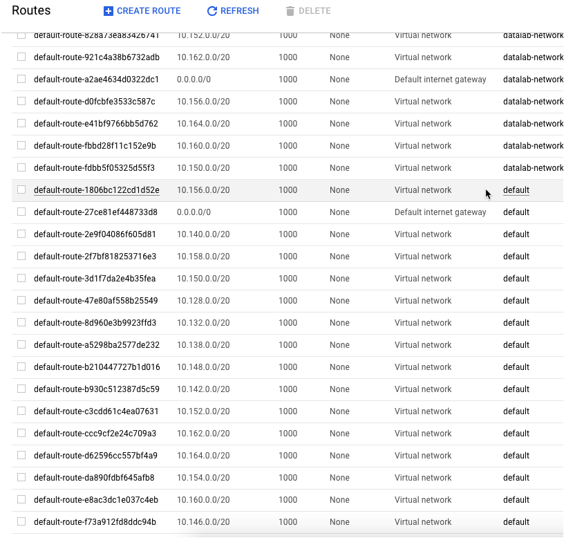

# GCP Commands

## Current Project

	gcloud info

## Switch Projects

	gcloud config set project $PROJECT

## Clone GCP Repo

	gcloud source repos clone <repo> --project=<projectname>
	   or
    git clone https://source.developers.google.com/<project>/r/<repo>

## SSH to GCP

	gcloud compute ssh --zone "us-east1-c" --ssh-flag="-N" --ssh-flag="-L" --ssh-flag="localhost:8081:localhost:8080" "<login>@datalabtutorial"
	gcloud compute ssh <login>@datalabvm

## gcloud interactive

	gcloud alpha interactive

## SSH/SCP to Cloud Shell

	gcloud alpha cloud-shell ssh
	gcloud alpha cloud-shell scp cloudshell:~/data.txt localhost:~
	gcloud alpha cloud-shell scp --recurse localhost:./Projects cloudshell:~ 

## SSH/SCP to Cloudtop

To ssh:

	gcert
	ssh ldap@ldap.c.googlers.com
	scp <local> ldap@ldap.c.googlers.com:/usr/local/google/home/<ldap>/<remote>

Further instructions on SSH and remote desktop at:
https://support.google.com/techstop/answer/2693936?hl=en&ref_topic=2739225
https://support.google.com/techstop/answer/2841128

## Linux

	tar -czvf name-of-archive.tar.gz /path/to/directory-or-file
	grep -r "some text" .

## Get an OAuth Token (given a service account key file)

	gcloud auth print-access-token
  https://developers.google.com/identity/protocols/OAuth2
## Pub/Sub Topic publish & subscribe

From nodejs-docs-samples/pubsub:

	node subscriptions.js listen projects/<project name>/subscriptions/cox_stream_tap
	node topics.js publish projects/<project name>/topics/coxdemo "heyhey"
  
## BigQuery DELETE
You have to use Standard, not Legacy, SQL

	DELETE from  dataset.table where columna is null

## Default network settings

	subnets - one per GCP region for each VPC network (currently 15)

	firewall rules - allow icmp, tcp:3389 (for rdp) and tcp:22 (ssh) from 0.0.0.0/0

	routes - one default route per region per network.  If there are 15 subnets on the VPC, there should be at least 15 routes

